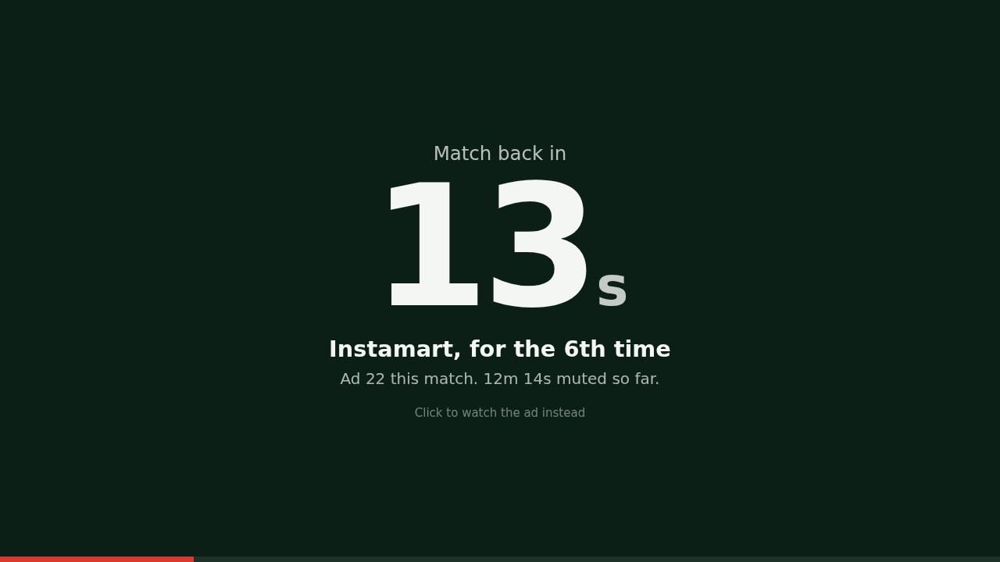
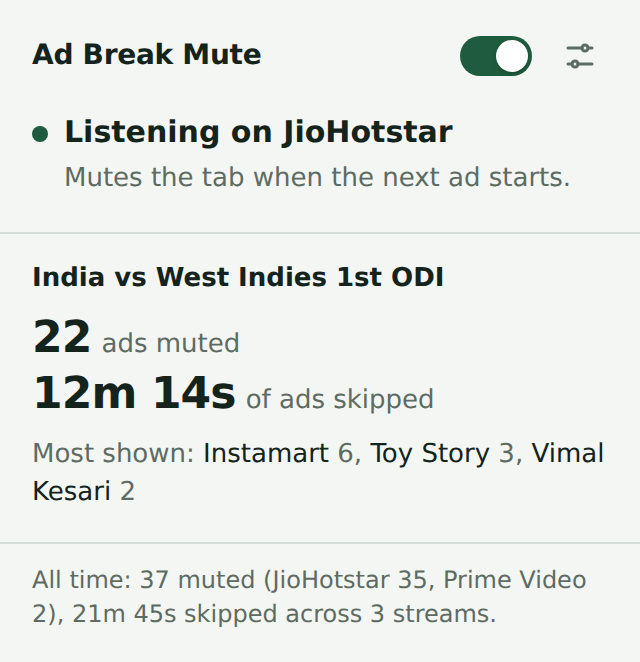
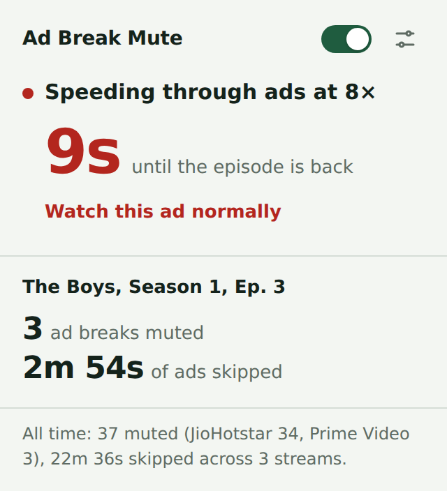
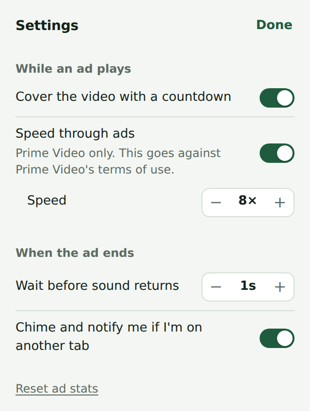

# Ad Break Mute

A Chrome extension that mutes ad breaks while you stream, covers them with a countdown, and tells you when your
match, episode or movie is back. On Prime Video it can also speed through the ads.

  

  
  
  

## What it does

- **Mutes each ad** for exactly as long as it runs, and brings the sound back when your stream resumes.
- **Covers the video with a countdown** showing when you're back, which brand is on (JioHotstar), and a running tally.
  Click the countdown if you'd rather watch an ad.
- **Speeds through Prime Video ads** at a speed you choose (2 to 16×), muted and covered, then returns to normal speed.
- **Counts ads** per match, episode and movie, plus all-time totals.
- **Tells you when you're back.** If you're on another tab when the break ends, you get a chime and a notification.
- **Leaves your own mute alone.** If you muted the tab yourself, it stays muted.

## Supported sites

| Site | Works on | How it spots ads |
|---|---|---|
| JioHotstar | Live matches and shows in Chrome | The player's ad list and its "ad started" signal, which include each ad's length |
| Prime Video | Series and movies on primevideo.com | The ad countdown in Prime's player |

It doesn't work in the JioHotstar or Prime Video apps on TVs, phones or tablets, only in Chrome on a computer.

## Install

Download the zip from the latest [release](../../releases), unzip it somewhere permanent, then in
`chrome://extensions` turn on **Developer mode**, click **Load unpacked** and choose the `ad-break-mute` folder.

**Step-by-step guide with screenshots, updating and troubleshooting: [docs/INSTALL.md](docs/INSTALL.md).**

## Using it

Click the icon for the popup. It shows what the extension is doing right now, the tally for what you're watching,
and all-time totals. The switch at the top turns it off and on. The settings button opens:

- **Cover the video with a countdown**
- **Speed through ads** (Prime Video) and the speed to use
- **Wait before sound returns**, if the last moment of an ad sometimes slips through
- **Chime and notify me if I'm on another tab**
- **Reset ad stats**

## Privacy

Your ad stats and settings stay in Chrome's own extension storage.

**Anonymous stats are on by default during the beta.** The popup says so the first time you open it, with a
**Turn off** button, and you can change it any time in Settings → Privacy. While it's on, the extension sends batches
of events to a Google Sheet only the developer can see:

- **What's sent:** a random install id, the extension version, the day, and for each ad the site, its length,
  whether its length was known, how it was spotted, the speed, and on JioHotstar the brand. It also sends how each
  break ended, and once a day which settings you use.
- **What's never sent:** what you watch (titles, links, match or show ids), the time of day, or anything about you.
- **Turning it off** deletes the install id and anything not yet sent.

The full list is in [docs/ANALYTICS.md](docs/ANALYTICS.md).

The extension asks for:

- **Access to hotstar.com and primevideo.com**, to see when an ad starts and ends. It can't read any other site.
- **Storage**, for your settings and stats.
- **Notifications**, for the "your match is back" alert.
- **Alarms**, to send shared stats in batches every half hour rather than after every ad.

## Reporting a problem

[Open an issue](../../issues/new/choose) and include:

- the site, and what you were watching,
- what happened and what you expected,
- the lines starting with `[Ad Break Mute` from the DevTools Console (**View → Developer → JavaScript Console**
  on the streaming tab) from around the ad break.

## Disclaimer

Not affiliated with or endorsed by JioStar or Amazon. The extension depends on how each site's player works, so
an update on their side can break it until it's fixed here. Speeding through ads goes against Prime Video's terms of
use; you can turn that off in settings.

## Developing

See [docs/DEVELOPING.md](docs/DEVELOPING.md) for how the extension is organised and how to add a site.
To investigate a new site, paste [`tools/generic-ad-probe.js`](tools/generic-ad-probe.js) into its DevTools Console,
mark a few ad breaks, and run `__adProbe.report()` to see which signals line up with them.
