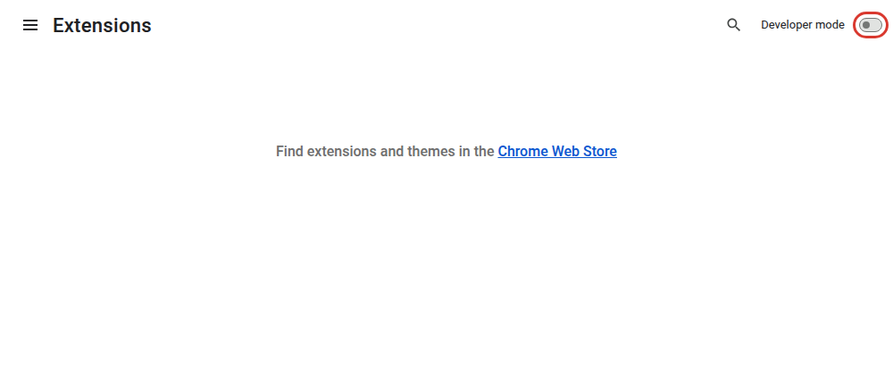
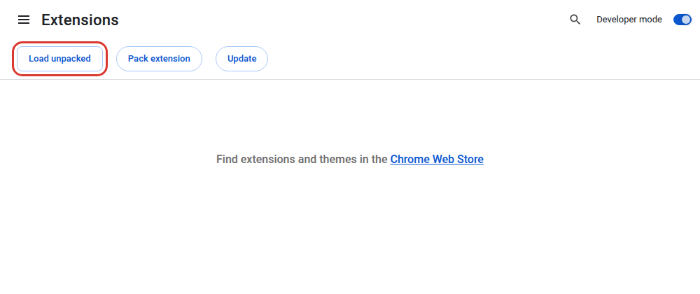
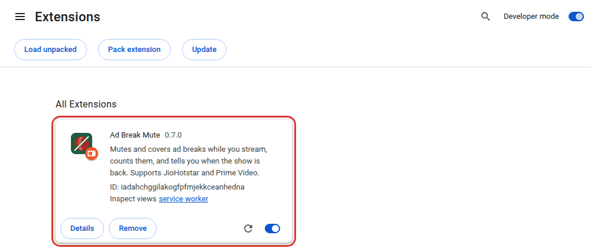
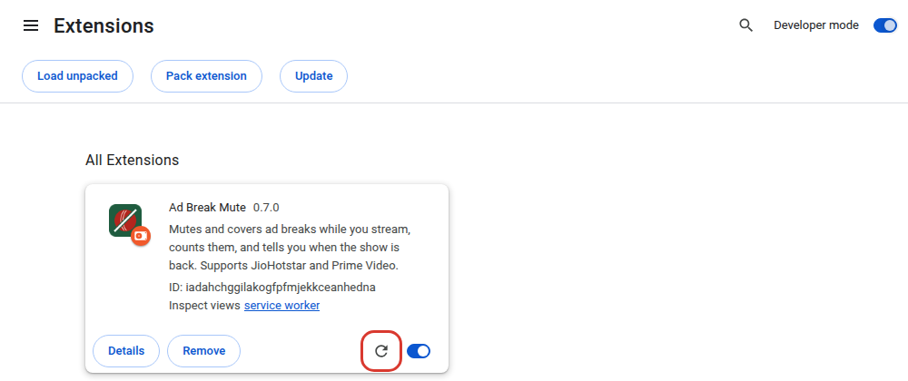

# Installing Ad Break Mute

This takes about two minutes. You need Chrome on a Mac or Windows computer; Edge and Brave work the same way.
It doesn't work on phones, tablets or TVs.

## 1. Download it

1. Go to this repo's [Releases](../../../releases) page. The repo is private, so sign in to GitHub with the account
   that was invited.
2. Under the newest release, click **Assets**, then `ad-break-mute-<version>.zip`.
3. Unzip it (double-click on a Mac). You'll get a folder called `ad-break-mute`.
4. Move that folder somewhere permanent, such as `Documents`. Chrome runs the extension from this folder, so if you
   delete or move it later, the extension stops working.

## 2. Turn on Developer mode

Open a new tab and go to `chrome://extensions` (type it into the address bar). Turn on **Developer mode** at the top
right.

## 3. Load the extension

Click **Load unpacked**, then choose the `ad-break-mute` folder from step 1: the folder itself, not a file inside
it.

Ad Break Mute appears in your list of extensions. If Chrome asks whether it may show notifications, allow it; that's
for the "your match is back" alert.

## 4. Pin it

Click the puzzle-piece icon at the right of Chrome's toolbar, then the pin next to **Ad Break Mute**. Its icon, a
cricket ball with a line through it, now sits in your toolbar.

## 5. Check it's working

1. Open [JioHotstar](https://www.hotstar.com) or [Prime Video](https://www.primevideo.com) and start watching
   something. If a tab was already open, refresh it first.
2. Click the Ad Break Mute icon. It should say **Listening on JioHotstar** (or Prime Video).
3. When an ad starts, the tab mutes, the icon shows **AD**, and a countdown covers the video.

During the beta, it shares anonymous stats (ad lengths, sites and settings, never what you watch) to help find
problems. The popup mentions this the first time you open it; click **Turn off** if you'd rather not, or change it
later in Settings → Privacy.

## Updating to a new version

1. Download the new zip from [Releases](../../../releases) and unzip it.
2. Delete everything inside your existing `ad-break-mute` folder, and copy in the new files. Keeping the same folder
   keeps your settings and ad stats.
3. Go to `chrome://extensions` and click the reload icon on Ad Break Mute's card.
4. Refresh any JioHotstar or Prime Video tabs.

## Removing it

Go to `chrome://extensions`, click **Remove** on Ad Break Mute's card, then delete the `ad-break-mute` folder.

## If something's not right

| What you see | What to do |
|---|---|
| The popup says **Reload this tab** | The tab was open before you installed or updated. Refresh it. |
| The popup says **Open JioHotstar or Prime Video** while you're on one | Check the address starts with `hotstar.com` or `primevideo.com`. Prime Video through `amazon.in` isn't supported yet. |
| **Load unpacked** says "Manifest file is missing" | You chose the wrong folder. Choose the `ad-break-mute` folder that contains `manifest.json`. |
| Chrome warns about developer-mode extensions | Expected for extensions installed this way. Keep it. |
| An ad played with sound, or the sound came back late | [Report it](../../../issues/new/choose), with the console lines described in the form. |
| The extension disappeared | The folder was moved or deleted. Put it back, or load it again. |
